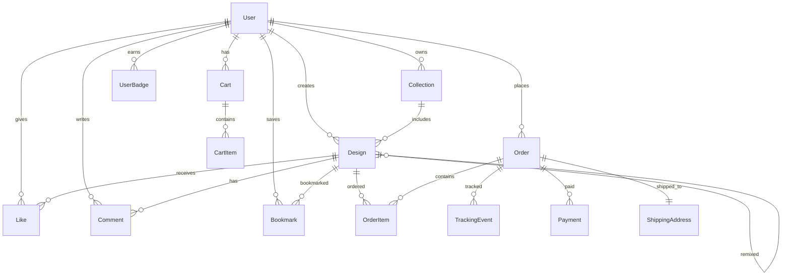

# ClothIQ Data Models Documentation

## Overview

This document describes the comprehensive data model architecture for the ClothIQ AI-powered custom apparel platform. The models are organized into 6 domains to support all application features.

## Model Organization

```
NewModels/
├── Core/           # Base entities (User, Design, Enums, BaseEntity)
├── AI/             # AI generation workflow
├── Social/         # Social features (Likes, Comments, etc.)
├── Orders/         # Order fulfillment and tracking
├── Commerce/       # E-commerce (Cart, Products, Payments)
└── Collections/    # Organization (Collections, Tags, Categories)
```

## Entity Relationship Diagram



## Domain Models

### 1. Core Domain

**BaseEntity** - Abstract base class
- `Id` (Guid, PK)
- `CreatedAt`, `UpdatedAt`, `DeletedAt`
- `IsDeleted` (soft delete support)

**User** - Enhanced user profile
- Basic: Username, Email, PasswordHash
- Profile: Bio, AvatarUrl, CoverImageUrl, Location
- Social: IsVerified, CurrentBadge, Followers/Following counts
- Stats: TotalDesigns, TotalLikes
- Preferences: Default settings for creation workflow
- Relations: Designs, Orders, Likes, Comments, Bookmarks

**Design** - Complete design entity
- Owner: UserId → User
- AI: Prompt, NegativePrompt, StylePreset, Resolution, Seed
- Specs: ClothingType, Color, Size, Material, PrintPosition
- Images: GeneratedImageUrls (array), SelectedImageUrl, FinalImageUrl
- Status: Draft → Generating → Generated → Selected → Finalized → Published
- Social: LikesCount, CommentsCount, BookmarksCount, RemixCount
- Organization: Title, Description, Tags, Visibility
- Remix: OriginalDesignId (self-reference)

**Enums** - All enumeration types
- ClothingType: TShirt, Hoodie, Sweat, Tank, etc.
- ClothingSize: XS, S, M, L, XL, XXL, XXXL
- Material: HeavyCotton, Polyester, Blend, etc.
- DesignStatus, OrderStatus, PaymentStatus, BadgeType, etc.

### 2. AI Generation Domain

**AIGenerationRequest**
- User prompt + negative prompt
- Style preset selection
- Garment specifications
- Advanced settings (resolution, seed)
- Validation and prompt enhancement

**AIGenerationResponse**
- Multiple generated image URLs
- Success/failure status
- Content moderation flags
- Generation metadata (model, tokens, cost)

**StylePreset**
- Predefined styles (Cyberpunk, Anime, Minimalism, Oil Paint)
- Prompt templates
- Example outputs

### 3. Social Features Domain

**Like** - User → Design
**Comment** - With reply support (ParentCommentId)
**Bookmark** - Saved designs with optional Collection
**Remix** - Tracks design remixes
**UserBadge** - Achievement system
**Follow** - User following relationships

### 4. Orders & Fulfillment Domain

**Order**
- OrderNumber, UserId, Status, ProgressStep (1-4)
- Items collection
- Pricing: Subtotal, Shipping, Tax, Discount, Total
- Tracking: TrackingEvents, CarrierName, TrackingNumber
- Timestamps: Placed, Confirmed, Shipped, Delivered

**OrderItem**
- Order → Design relationship
- Specs: ClothingType, Size, Material, Color
- Quantity, UnitPrice, TotalPrice
- Production tracking

**TrackingEvent**
- Order milestone tracking
- Location, EventDate, IsActive
- Factory methods for common events

**ShippingAddress**
- Full address details
- Validation status
- Default/billing flags

### 5. E-commerce Domain

**Cart**
- User shopping cart
- CartItems collection
- Pricing summary (cached)
- Promo codes and discounts
- Expiration tracking

**CartItem**
- Cart → Design
- Specifications and quantity
- Price locking mechanism

**Product**
- Base product catalog
- Pricing (base + sale)
- Available options (sizes, colors, materials)
- Production estimates
- Inventory management

**Payment**
- Transaction records
- Payment method and processor details
- Card information (tokenized)
- Billing address
- Status tracking and refunds

### 6. Collections & Organization Domain

**Collection**
- User-created design collections
- Visibility settings (Public/Private/Unlisted)
- DesignIds (JSON array)
- Statistics (views, likes)

**Tag**
- Design tags for search/filtering
- Usage statistics
- Trending calculation

**Category**
- High-level design categories
- Hierarchy support (parent/sub-categories)
- Default categories: Cyberpunk, Minimalist, Vintage, Gothic, etc.

## Key Relationships

### User-Centric
- User creates Designs (1:M)
- User places Orders (1:M)
- User has one active Cart (1:1)
- User owns Collections (1:M)
- Users follow each other (M:M)

### Design-Centric
- Design belongs to User (M:1)
- Design receives Likes (1:M)
- Design has Comments (1:M)
- Design in OrderItems (1:M)
- Design can be remixed (1:M)

### Order Flow
- Cart → Order conversion
- Order → OrderItems → Design
- Order → TrackingEvents
- Order → Payment
- Order → ShippingAddress

## Usage Examples

### Creating AI Generation Request
```csharp
var request = new AIGenerationRequest
{
    UserId = currentUserId,
    Prompt = "Cyberpunk neon tiger",
    NegativePrompt = "blur, low quality",
    StylePreset = StylePresetType.Cyberpunk,
    ClothingType = ClothingType.TShirt,
    Color = "#000000",
    Size = ClothingSize.L,
    Material = Material.HeavyCotton,
    Resolution = Resolution.FourK,
    NumberOfImages = 6
};

var enhancedPrompt = request.BuildEnhancedPrompt();
```

### Building an Order
```csharp
var order = new Order
{
    OrderNumber = Order.GenerateOrderNumber(),
    UserId = userId,
    Status = OrderStatus.Pending,
    Items = cartItems.Select(ci => new OrderItem
    {
        DesignId = ci.DesignId,
        Quantity = ci.Quantity,
        UnitPrice = ci.UnitPrice,
        // ... other properties
    }).ToList()
};

order.UpdateProgressStep();
```

### Social Interaction
```csharp
// Like a design
var like = new Like { UserId = userId, DesignId = designId };
design.LikesCount++;

// Add comment
var comment = new Comment
{
    UserId = userId,
    DesignId = designId,
    Text = "Amazing design!",
    ParentCommentId = replyToId // optional
};
```

## Migration Guide

### From Old Models to New Models

| Old Model | New Model | Changes |
|-----------|-----------|---------|
| `Models/Design.cs` | `NewModels/Core/Design.cs` | + AI metadata, + social features, + multi-images |
| `Models/User.cs` | `NewModels/Core/User.cs` | + social profile, + preferences, + stats |
| `Models/ClothingType.cs` | `NewModels/Core/Enums.cs` | Consolidated all enums, + new values |
| N/A | `NewModels/Orders/*` | NEW: Complete order system |
| N/A | `NewModels/Social/*` | NEW: Social features |
| N/A | `NewModels/Commerce/*` | NEW: E-commerce |

### Breaking Changes
1. `Design.GeneratedImageUrl` → `Design.GeneratedImageUrls` (array)
2. `ClothingType` enum values updated
3. New required fields on Design (Status, Resolution)
4. BaseEntity now has soft delete support

## Best Practices

1. **Always use BaseEntity** for new entities
2. **Denormalize counts** for performance (LikesCount, FollowersCount)
3. **Use enums** instead of magic strings
4. **Soft delete** instead of hard delete
5. **Track timestamps** (CreatedAt, UpdatedAt)
6. **Validate inputs** using Data Annotations
7. **Use helper methods** for complex logic
8. **JSON for arrays** when M:M not needed

## Next Steps

1. Review models and provide feedback
2. Set up Entity Framework DbContext
3. Create migrations
4. Update services to use new models
5. Migrate existing data
6. Update UI components

---

**Version:** 1.0  
**Last Updated:** January 2026  
**Author:** ClothIQ Development Team
